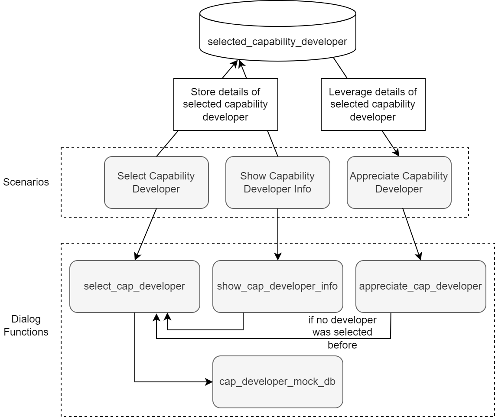

# Appreciate Capability Developer

This capability allows to show information on capability developers and appreciate them for great work. 

It leverages the context variables feature to store and read capability developer information from and to the conversation.

