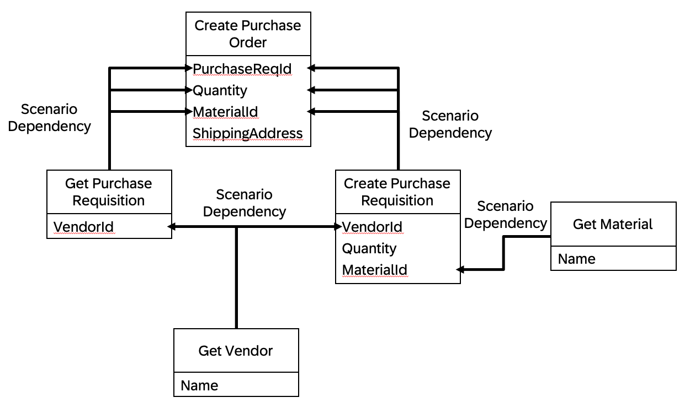

# Scenario Dependencies Capability / Create Purchase Order

This capability allows to create purchase orders, purchase requisitions and to show other business data. 

It leverages scenario dependencies to orchestrate complex processes. The data is hard-coded. In a productive setting it would be fetched from an API.

Try the following inputs:

- Create a purchase order
- Show material Computer
- Get purchase requisitions for vendor Electro Supplies

