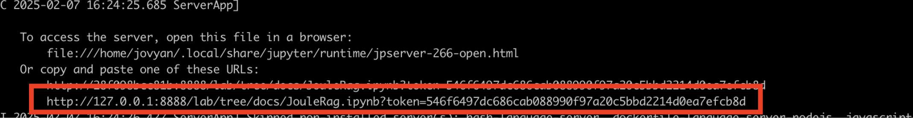

# Setting up Joule on BTP in minutes

## Prerequisites

These steps require
- you have either [Docker](https://docs.docker.com/get-started) or [Podman](https://podman.io/) installed, and 
- you have access to either [BTP's Canary - Public Cloud Feature Set B Landscape](https://cp-control-client-uc2.cfapps.sap.hana.ondemand.com/index.html) or [BTP's Live - Public Cloud Feature Set B Landscape](https://cp-control-client-uc2.cfapps.eu10.hana.ondemand.com/index.html)

## Automated Joule setup with Jupyter Notebook

The goal here is to simplify your initial journey into Joule.

To do this, we offer a Docker (or Podman) image, preinstalled with a Jupyter Notebook and useful libraries (including Joule cli, BTP cli, Python, NPM, curl, maven, jq) 

When you run the docker (or Podman) command below, it will open a Jupyter Notebook, detailing the two steps you need to follow to install and log into Joule. A video of ths process is shared [here](https://sapvideo.cfapps.eu10-004.hana.ondemand.com/?entry_id=1_v82dxmhk).
  - The first step you will take is to setup a BTP account with appropriate rights. 
  - The second is to run a script (called "installjouleonbtp.sh") that makes multiple calls to the BTP CLI, to populate your newly-created BTP account with Joule, Cloud Foundry, Document Grounding and other options.  This essentially automates the steps you might otherwise perform manually, for example for [Joule](https://help.sap.com/docs/joule/9f9313e986d24fc495b820f9f725a824/48e8f655470048c29555272578fbc2ce.html), [Document Grounding](https://help.sap.com/docs/joule/9f9313e986d24fc495b820f9f725a824/ade9ce3c7c5546988cccea15ec35d373.html). (You can browse that file in your Juypter notebook at docs/material/docker/installjouleonbtp.sh)
  - Two further steps show how to login and access joule, again directly in the Jupyter notebook
  
## Open and follow the Jupyter Notebook

Open and follow this AIWarmup within Jupyter.  To do so:

- either install [Docker](https://docs.docker.com/get-started) and run
```
docker run -p 8888:8888 -v $PWD/temp:/home/jovyan/docs/temp --platform linux/amd64 kenlomax/aiwarmupsdocker:v1.0.0 bash setupandrunnotebook.sh JouleSetup.ipynb
```

- or install [Podman](https://podman.io/) and
 run

```
podman run -p 8888:8888 -v $PWD/temp:/home/jovyan/docs/temp --platform linux/amd64 kenlomax/aiwarmupspodman:v1.0.0 bash setupandrunnotebook.sh JouleSetup.ipynb
```

- Then open the url that will appear towards the end of the output,  starting with 127.0.0.1:8888/lab.... 



-  This will open a Jupyter Notebook looking similar to 


- Follow the steps in the "Joule Setup" AI Warmup, that also includes a video of that journey.

You should now have a Joule environment that is ready for action. If you want to learn more about additional tools, continue with [Step 1](../step1/index.md) otherwise jump-start your development [Step 2](../step2/index.md).

* [Back to Overview](../index.md)
* [Continue with Step 1](../step1/index.md)