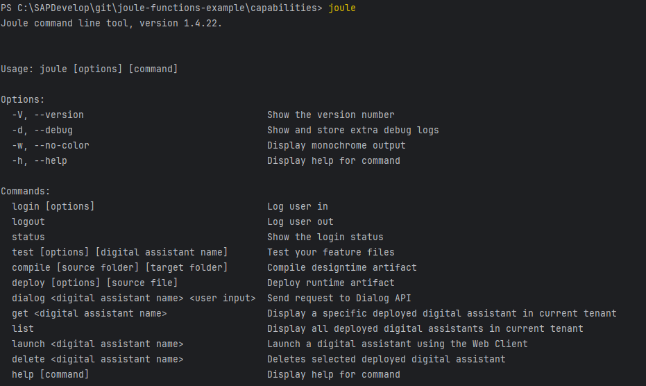
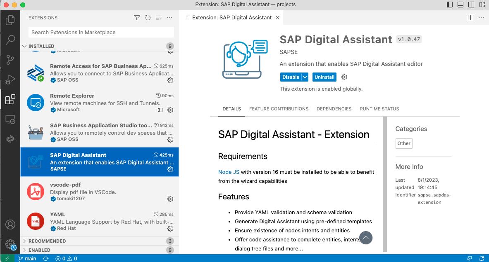

# Hello World - Step 1: Setting up the environment

In this step, we will install all the appropriate tools to make a Capability Developer Environment working.

## Preview



*The Joule Command Line Interface is running in your development environment*

## Prerequisite
- You have access to an SAP BTP account
- Visual Studio Code or a similar IDE is installed on your machine
- you are connected to the SAP Network

## Steps

### Automated Joule setup with Jupyter Notebook

If you have access to BTPS's [Canary](https://cp-control-client-uc2.cfapps.sap.hana.ondemand.com/index.html) or [Live](https://cp-control-client-uc2.cfapps.eu10.hana.ondemand.com/index.html) Landscape, you may choose to follow [this journey](../step0/index.md) to install Joule on BTP in minutes. 

If not, follow the "Onboard Joule to your BTP account manually" step below.

### Onboard Joule to your BTP account manually

Go to your SAP BTP global account and run the Joule initial setup steps:
https://help.sap.com/docs/joule/service-guide/initial-set-up

In the subaccount where you set up Joule, go to `Instances & Subscriptions`and press on the Subscription `Joule`.
A message "The service is up and running." should appear. Joule is now ready to use.

### Install Joule IDE Extension

If you are using Visual Studio Code, follow the Joule IDE Extension installation guideline:
https://help.sap.com/docs/joule/service-guide/joule-ide-extension

Make sure that you see the IDE Extension in the plugin section:



**Note:** The Joule IDE Extension is great for code completion and syntax highlighting in the YAML files for Joule capabilities. However, it does not create a project structure for the new Joule functions yet. 
For the moment, we will manually create the needed files for the capability as part of the tutorial instead of using the wizard and update the tutorial to use the IDE extension later on when this new functionality is available.

### Install Joule Command Line Interface (CLI) 

Follow the Joule Command Line Interface installation guideline:
https://help.sap.com/docs/joule/service-guide/sap-digital-assistant-command-line-interface

In short, install the Joule CLI by running the following command:

```npm install -g @sap/sapdas-cli --registry=https://int.repositories.cloud.sap/artifactory/api/npm/build-releases-npm```

Run the CLI command line tool by typing `joule` or `sapdas` in a shell:


* [Back to Overview](../index.md)
* [Continue with Step 2](../step2/index.md)

## Related Information 

[Joule Development Guideline](https://help.sap.com/docs/joule/service-guide/development)
