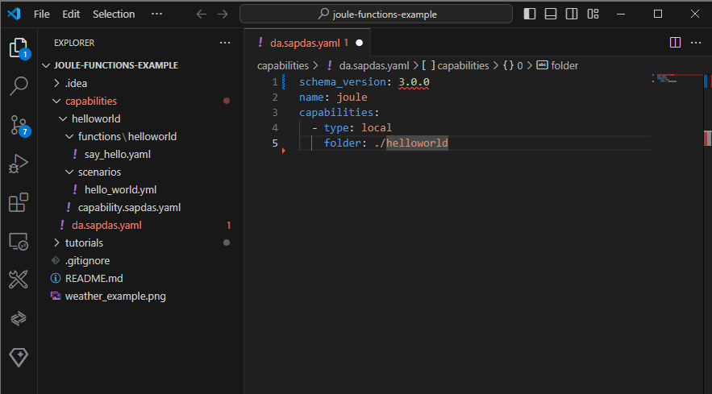

# Hello World - Step 2: Create a new assistant and the "hello world" capability

In this step, we will create a new digital assistant.

*Please note that the Joule IDE Extension does not support the latest schema and Joule functions yet. 
For the moment, we will manually create the needed assets and update the tutorial later on when this functionality is available.*  

## Preview



* The project structure in Visual Studio Code

## Steps

### capabilities/da.sapdas.yaml (NEW)

```yaml
schema_version: 1.0.0
name: joule_assistant
capabilities:
  - type: local
    folder: ./helloworld
```

We create a basic configuration file for our digital assistant. It defines a set of capabilities that the assistant can use.

1. Create a new folder in your project root directory and name it `capabilites`.
2. Add a new file `da.sapdas.yaml` in the newly created folder
2. Set the schema version to `1.0.0`
3. Set the name to `joule_assistant`
4. Add a new capability of type `local` and set the folder to `./helloworld`

### capabilities/helloworld/capability.sapdas.yaml (NEW)

```yaml
schema_version: 3.6.0

metadata:
  namespace: com.sap.das.demo
  name: helloworld_capability
  version: 1.0.0
  display_name: "Hello World Capability"
  description: "This capability says hello world."
```

We add a new hello world capability to our assistant by specifying the display name and the description:

1. Create a new subfolder in your `capabilites` folder and name it `helloworld`.
2. Add a new file `capability.sapdas.yaml` in the newly created folder
3. Copy the content above into the file
4. Set the schema version to `3.6.0`

*Note:* Set the schema version for your capability to the latest version to be able to use all available Joule features in your capability. You can find more information on the design time artifact specification [here](https://help.sap.com/docs/digital-assistant/service-guide/design-time-artifact-specification).

### capabilities/helloworld/scenarios/hello_world.yaml (NEW)

```yaml
description: This function says hello world or the name of the user

slots:
- name: name
  description: The name of the person to be greeted

target:
  type: function
  name: say_hello
```
Next, we define the scenario for the capability. It contains the parameters (slots) and the dialog function to call.
Be sure to provide a meaningful description for the scenario as this parameter will be included in the prompt for scenario selection.

1. Create a new folder in your `helloworld` folder and name it `scenarios`.
2. Create a new file `hello_world.yaml` in the newly created folder
3. Define a slot `name` that can be filled with a name in the prompt. The slot will be filled if the user specifies a name throughout the conversation.
4. Define the target function `functions/hello_world` that will be called when the scenario is triggered

Note that we do not have to define dialogs and intents anymore with the new Joule architecture.
The description of the scenario and the slots is sufficient to trigger the function implicitly.

### capabilities/helloworld/functions/say_hello.yaml (NEW)

```yaml
parameters:
  - name: name
    optional: true
action_groups:
  - condition: name != null
    actions:
      - type: message
        message: 
            type: text 
            content: "Hello <? name ?> from joule function!"
  - condition: name == null
    actions:
      - type: message
        message:
            type: text
            content: "Hello world from joule function!"
```

Finally, we add the joule function that will show the hello world message to the user. We use the `name` parameter to personalize the message. If it is filled, we greet the user with the name provided. If not, we just show a general "Hello World" message. 

1. Create a new folder in your `helloworld` folder and name it `functions`.
2. Create a new file `hello_world.yaml` in the folder `helloworld` for the dialog function
3. Define an optional parameter `name` as an input for the function that will be connected to the slot above
4. Define two action groups that will be executed based on the condition if the name is provided or not 
5. Add output messages that will be displayed in the chat window for both scenarios

## Summary

We have created an assistant and a function to our project. The overall project structure should look like this:

```
└── capabilities/ // assistant root
    ├── helloworld/ // capability root
        ├── functions // root for functions
            └── say_hello.yaml // hello world function
        ├── scenarios/ // root for scenarios
            └── hello_world.yaml // hello world scenario
        └── capability.sapdas.yaml // capability definition
    └── da.sapdas.yaml  // assistant definition combining capabilities
```

* [Back to Overview](../index.md)
* [Continue with Step 3](../step3/index.md)

## Related Information 

[Build a capability](https://help.sap.com/docs/joule/service-guide/build-capability)
