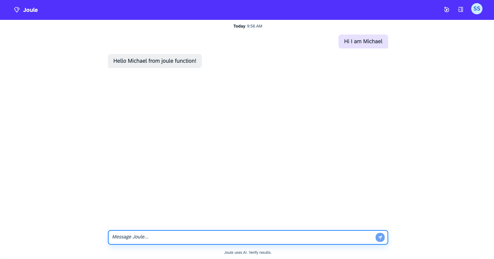

# Hello World - Step 3: Deploy the assistant and test the "hello world" capability

In this step, we will test our new assistant and the "hello world" capability.

## Preview



## Steps

### Optional: Lookup login parameters in your BTP account

To login to your BTP account and Joule service instance, you need to specify authentication parameters that can be found in your BTP subaccount:

1. Go to `Services` and press `Instances and Subscriptions in the main menu of your BTP subaccount.
2. Open the service instace `Joule`, the details for this service will open in the third column.
3. In the `Services Keys` panel, press the three dots on the key entry and select `View`.
4. A new popup with the credentials for this service will open, see the mapping to the fields in the command below.

**Troubleshooting:** If you cannot see the credentials, you may be mission permissions in the BTP subaccount or you need to create a new service key.

### Login to your BTP account

1. Open a terminal and go to the `capabilities` folder
2. Run the following command to log in to your BTP account:
```bash
joule login --apiurl '<apiurl>' -a '<url>' -c '<clientid>' -s '<clientsecret>' -u '<youruser>' -p '<yourpassword>'
```

*Hint:* Check the help for all available command line options, type `joule login --help`.

### Optional: Compile your assistant

1. Go to the 'helloworld` folder and run the following command to compile your assistant:
```bash
joule compile
```

In case there are errors in your assistant, the compiler will show you the errors and you can fix them before deploying the assistant.

### Deploy your assistant

1. Run the following command in your `capabilities` folder to deploy your assistant:
```bash
joule deploy -c -n "helloworld"
```

By specifying the `-c` option, you will compile the assistant before deploying it.

Specify a name parameter with the `-n` option to give your assistant a name. This name will be used to identify your assistant in the Joule server and help to avoid conflicts with other assistants running on the same account.

### Test your assistant in the command line

1. Run the following command in your `capabilities` folder to test your assistant:
```bash
joule dialog helloworld "say hello world"  
```

You will receive a JSON response with the joule message "Hello World from joule function!" in the console.

### Test your assistant in the standalone web client:

1. Run the following command to open the standalone web client:
```bash
joule launch helloworld
```
2. A Browser will open with the joule web client. You can now test your assistant in the chat window.
3. Type "what can you do" to see the available capabilities.
4. Type "hello world" to trigger the hello world capability.
5. Type "Hi, I am \<your name\>" to trigger the hello world capability with your name.

Congratulations! You have just developed and tested your first Joule capability. But we are not done yet, let's take a look at making your capability enterprise-ready in the next step.

* [Back to Overview](../index.md)
* [Continue with Step 4](../step4/index.md)

## Related Information 

[Test the capability](https://help.sap.com/docs/joule/service-guide/test-capability)