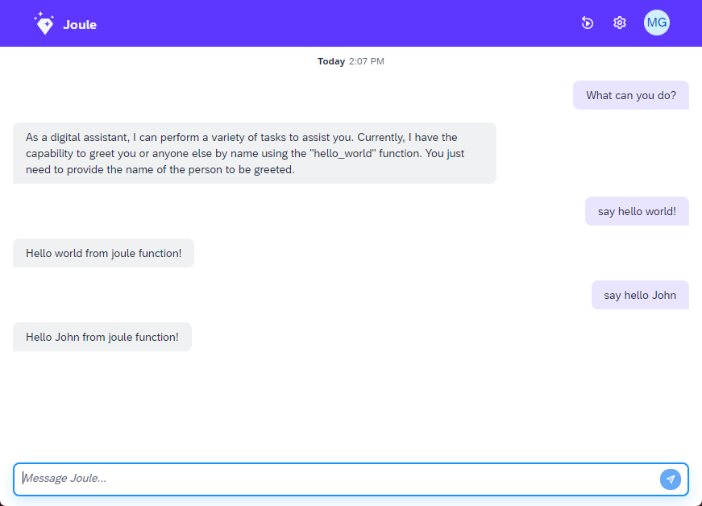

# Hello World - Step 4: Internationalization (i18n)

In this step, we are going to replace the hardcoded helloworld message with an internationalized version.

## Preview



## Steps

### capabilities/helloworld/functions/say_hello.yaml

```yaml
parameters:
  - name: name
    optional: true
action_groups:
  - condition: name != null
    actions:
      - type: message
        message: 
            type: text 
            content: "<? new i18n('HELLO_WITH_PARAM', name) ?>"
  - condition: name == null
    actions:
      - type: message
        scripting_type: handlebars
        message:
            type: text
            content: "{{ i18n 'HELLO' }}"
```
In the dialog function `say_hello` replace hard-coded messages with resource bundle entries:
1. replace the hello world message with the `name` placeholder with a scripting expression that loads the ressource bundle property `HELLO_WITH_PARAM`
2. replace the static hello world message with the handlebars shortcut to load the ressource bundle property `HELLO`  

> *Note*: Do not mix static messages and translated texts in dialog functions. All texts displayed to the user must be internationalized consistently. 

## i18n/messages.properties (NEW)

```properties
HELLO_WITH_PARAM=Hello {0} from joule function!
HELLO=Hello world from joule function!
```

1. Create a subfolder `i18n` in your capability `helloworld`
2. Add a new file `messages.properties` for the default bundle (English)

> *Note*: Placeholders in properties files are escaped with single curly brackets: The placeholder {0} is replaced at runtime by the helper function `i18n`.

## i18n/messages_es.properties (NEW)

```properties
HELLO_WITH_PARAM=Hola {0} de la función joule!
HELLO=Hola mundo de la función joule!
```
Add a second file `messages_es.properties` for the spanish bundle with the translated texts

> *Note:* Make sure the file is encoded in `UTF-8`to properly display the Spanish special characters. You IDE typically provides default settings for file encodings on a project level

### Optional: Add an additional language

For your reference, we have also included a French translation bundle in `messages_fr.properties`. If you like, add additional property files for other languages like German, Norwegian, Japanese, ...
A list of all supported languages in Joule can be found in the [documentation](https://help.sap.com/docs/joule/a047eeaab5b048f686265f79c567b3fa/e2ac18dba68c4156a17adddfa90de976.html).

### Testing the translated capability

1. Switch your browser's default language to Spanish:


2. Deploy and open the assistant as described in [Step 3](../step3/index.md). 

3. Greet Joule in Spanish: `Hola Joule` and see the translated response from your internationalized dialog function:


You have now successfully converted your Joule function to another language. Please do not use hard-coded texts in your dialog functions from now on :-)

That's a wrap! You have successfully completed the Joule Hello World tutorial. If you would like to learn about testing, please continue with Step 5.
 
* [Back to Overview](../index.md)
* [Continue with Step 5](../step5/index.md)

## Related Information 

* [Internationalization (i18n)](https://help.sap.com/docs/JOULE/4b327297dce247fcb88a5f5bfeea97a1/e2ac18dba68c4156a17adddfa90de976.html)
* [Scripting](https://help.sap.com/docs/joule/a047eeaab5b048f686265f79c567b3fa/4d2675edb26049dc96900df2a10b9a9b.html)
