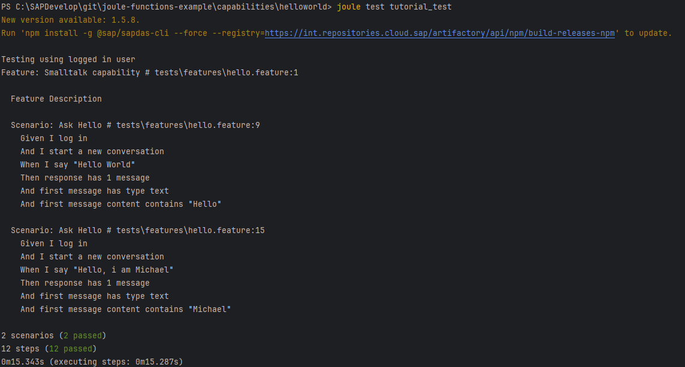

# Hello World - Step 5: Testing the Capability

In this step, we are going to replace the hardcoded helloworld message with an internationalized version.

## Preview



## Steps

## Initialize the testing configuration (one-time)

The following command creates the needed VScode configuration to enable the Gherkin validation and snippets

```bash
joule test --init
```

A file `.env` will be created in your root folder based on the login details you specified with the `joule login` command.

> *Note:* do not checkin this file to your code repository as it contains sensitive information

## helloworld/tests/features/hello.feature (NEW)

```gherkin
Feature: Smalltalk capability

Feature Description

  Background:
    Given I log in
    And I start a new conversation

  Scenario: Ask Hello
    When I say "Hello World"
    Then response has 1 message
    And first message has type text
    And first message content contains "Hello"

  Scenario: Ask Hello
    When I say "Hello, i am Michael"
    Then response has 1 message
    And first message has type text
    And first message content contains "Michael"
```

Now we are ready to write a feature test for our `helloworld` capability

1. Create a new subfolder in your `helloworld` folder and name it `tests`.
2. Add a new subfolder `features`below it
3. Add a new file `hello.feature` in the newly created folder
3. Define a [gherkin](https://cucumber.io/docs/gherkin/reference) feature as outlined above

A good practice is to test all logical branches for the capability. 
We create two scenario tests, one for the condition without the name, and one for the name slot beeing filled.

In the test, we can specify the user utterance with the trigger `I Say "<message sent to Joule>` and the condintions to be fullfilled in the `Then` part. In this case we just check that the response:
* Contains 1 Message
* Is of type text
* And contains the right content

It is in the nature of Large Language Models (LLMs) that the response might be a little different every time. Therefore, we just ensure that the essential parts are in the response and do not check for a specific text.

## Running the test in the command line

```joule test <assistant_name>```

Now let's run our new test and see if it succeeds. We have to specify the assistant name we want to use for testing.
In the console, you should see the test output similar to the screenshot in the preview.

Great, now we have also added a feature test for our scenario.
The following tutorials will always contain a testing step at the end and may contain more complex testing logic.

## Related Information 

* [Test the Capability](https://help.sap.com/docs/joule/service-guide/test-capability)
