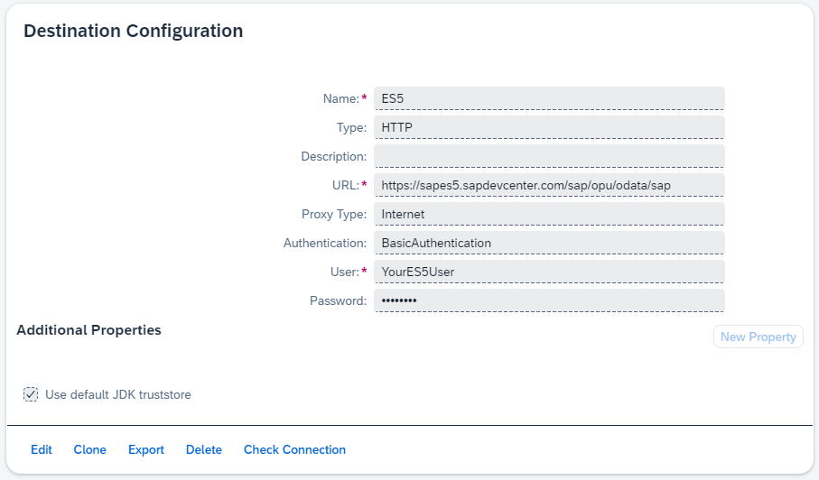

# Search Products - Step 1: Setting up the environment

In this step, we will set up the destination to access the SAP Gateway Demo System.

## Preview



*The ES5 destination is configured in your BTP account*

## Prerequisite
- You have set up Joule on your BTP account and installed the Joule tools [see Hello World - Step 1](../../helloworld/step1/index.md)

## Steps

### Register an account for the SAP Gateway Demo System

In this tutorial, we will use a typical OData service to fetch product data. 
The service is provided by the SAP Gateway Demo System ES5. To access the service, you need to register an account:
[Sig up for a demo account on ES5 here](https://register.sapdevcenter.com/SUPSignForms/)

More information about the Gateway Demo system can he found in this blog:
[Getting started with the SAP Gateway Demo System ES5](https://community.sap.com/t5/technology-blogs-by-sap/new-sap-gateway-demo-system-available/ba-p/13353480)

*Note:* Alternatively, you can also use the [Northwind OData service](https://services.odata.org/V2/Northwind/Northwind.svc/) for this tutorial if you like to try another OData service.

### Create ES5 Destination

To access the products API we use in this tutorial, we need to configure a destination in your BTP account.

1. Go to your SAP BTP global account and navigate to `Connectivity` > `Destinations`.
2. Press on `New Destination` and fill in the following information:

```properties
URL=https://sapes5.sapdevcenter.com/sap/opu/odata/sap
Name=ES5
ProxyType=Internet
Type=HTTP
Authentication=BasicAuthentication
UserName=<Your ES5 Gateway user>
Password=<Your ES5 Gateway password>
```

* [Back to Overview](../index.md)
* [Continue with Step 2](../step2/index.md)

## Related Information 

[HTTP Destinations](https://help.sap.com/docs/connectivity/sap-btp-connectivity-cf/http-destinations)