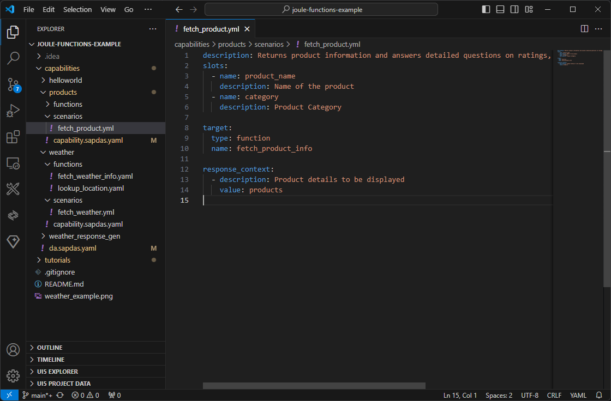

# Search Products - Step 2: Create the products capability and scenario

In this step, we will add the new products capability to our assistant.

*Please note that the Joule IDE Extension does not support the latest schema and Joule functions yet.
For the moment, we will manually create the needed assets and update the tutorial later on when this functionality is available.*

## Preview



*The project with the third capability and scenario added*

## Steps

### capabilities/da.sapdas.yaml


```yaml
schema_version: 1.0.0
name: joule_assistant
capabilities:
  - type: local
    folder: ./helloworld
  - type: local
    folder: ./weather
  - type: local
    folder: ./products
```

1. After `helloworld` and `weather`, add a third capability of type `local` and set the folder to `./products`

### capabilities/products/capability.sapdas.yaml (NEW)

```yaml
schema_version: 3.6.0

metadata:
  namespace: com.sap.das.demo
  name: products_capability
  version: 1.0.0
  display_name: "Products Capability"
  description: Search for products

system_aliases:
  ProductService:
    destination: ES5

```

We add a new products capability to our assistant by specifying the display name and the description:

1. Create a new subfolder in your `capabilites` folder and name it `products`.
2. Add a new file `capability.sapdas.yaml` in the newly created folder
3. Define the basic parameters for this capability as shown above
4. In the `system_aliases` we reference the BTP destination `ES5` with the alias `ProductService`.

### capabilities/products/scenarios/fetch_product.yaml (NEW)

```yaml
description: Search for products and answers detailed questions on ratings, price, technical specifications and supplier

target:
  type: function
  name: fetch_product_info

response_context:
  - description: Product details to be displayed
    value: products
```

Again, we define the scenario for the capability. It contains one parameter (slot) for the product name can be used for filtering the products.
Be sure to provide a meaningful description for the function as this parameter will be used by the dialog model to dispatch the user utterance to the right joule function.

1. Create a new folder in your `products` folder and name it `scenarios`.
2. Create a new file `fetch_product.yaml` in the newly created folder
4. Define the target joule function `fetch_product_info` that will be called when the scenario is triggered

As in the previous example, we simply define a `response_context` that will be used to present the response to the user.
The `description` fields in this fill will help Joule to identify the corresponding function and create a matching response.

## Summary

We have added a third assistant to our project. In Step 3, we will add the API call to search for products.
The overall project structure should look like this:

```
└── capabilities/ // assistant root
    ├── helloworld... 
    └── products/ // products capability
        ├── scenarios/ // root for scenarios
            └── fetch_product.yaml // products scenario
        └── capability.sapdas.yaml // capability definition
    └── weather... // weather capability
    └── da.sapdas.yaml  // assistant definition combining capabilities
```

* [Back to Overview](../index.md)
* [Continue with Step 3](../step3/index.md)

## Related Information

[Build a capability](https://help.sap.com/docs/joule/service-guide/build-capability)
