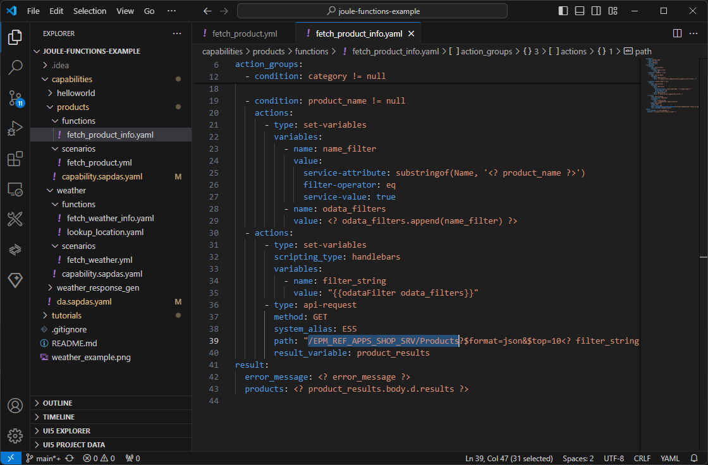

# Search Products - Step 3: Create the product search dialog function

This time, we integrate a more complex API that is able to search and filter for products using an OData service.

## Preview



*The project with the fetch products dialog function added*

## Steps

We will now add the `fetch_products_info` function within the `functions` folder.

### capabilities/products/functions/fetch_product_info.yaml (NEW)

```yaml
parameters:
  - name: product_name
    optional: true
action_groups:
  - actions:
      - type: api-request
        method: GET
        system_alias: ProductService
        path: "/EPM_REF_APPS_SHOP_SRV/Products?$format=json&$top=5"
        result_variable: product_results
result:
  products: <? product_results.body.d.results ?>
```

1. Create a folder `functions` in the `products` capability.
2. Create a file `fetch_product_info.yaml` in the `functions` folder of the `products` capability.
3. Copy the code above into the new file and analyze the configuration of the service call.

This function starts very simple, we just call the ES5 `Products` OData endpoint with the result set limited to 5 items and store the result in the `product_results` variable.

The final URL will look like this:
```/EPM_REF_APPS_SHOP_SRV/Products?$format=json&$top=5```

To get a better idea of the API response returned by the API, the following URL can be either called via Postman or directly in the browser: https://sapes5.sapdevcenter.com/sap/opu/odata/sap/EPM_REF_APPS_SHOP_SRV/Products?$format=json&$top=5

As the `result` for this function, we simply pass the array of products to the response generation of Joule.

## Test your result

1. Run the following command in your `capabilities` folder to deploy your assistant:
```bash
joule deploy -c -n "products"
```

2. Run the following command to open the standalone web client:
```bash
joule launch "products"
```
1. A Browser will open with the joule web client. You can now test your assistant in the chat window.
2. Type `View products` to call the new capability.
3. A list of 5 products is shown in the chat window.

## Summary

We have now added the dialog functions to the external API to our project and are ready to enhance it in the next step.
The overall project structure should look like this:

```
└── capabilities/ // assistant root
    ├── helloworld... 
    └── products/ // products capability
        ├── functions/ // root for functions
            └── fetch_product_info.yaml // product search function 
        ├── scenarios/ // root for scenarios
            └── fetch_product.yaml // products scenario
        └── capability.sapdas.yaml // capability definition
        └── weather... // weather capability
    └── da.sapdas.yaml  // assistant definition combining capabilities
```

* [Back to Overview](../index.md)
* [Continue with Step 4](../step4/index.md)

## Related Information 

[Dialog Functions](https://help.sap.com/docs/joule/service-guide/dialog-functions)
