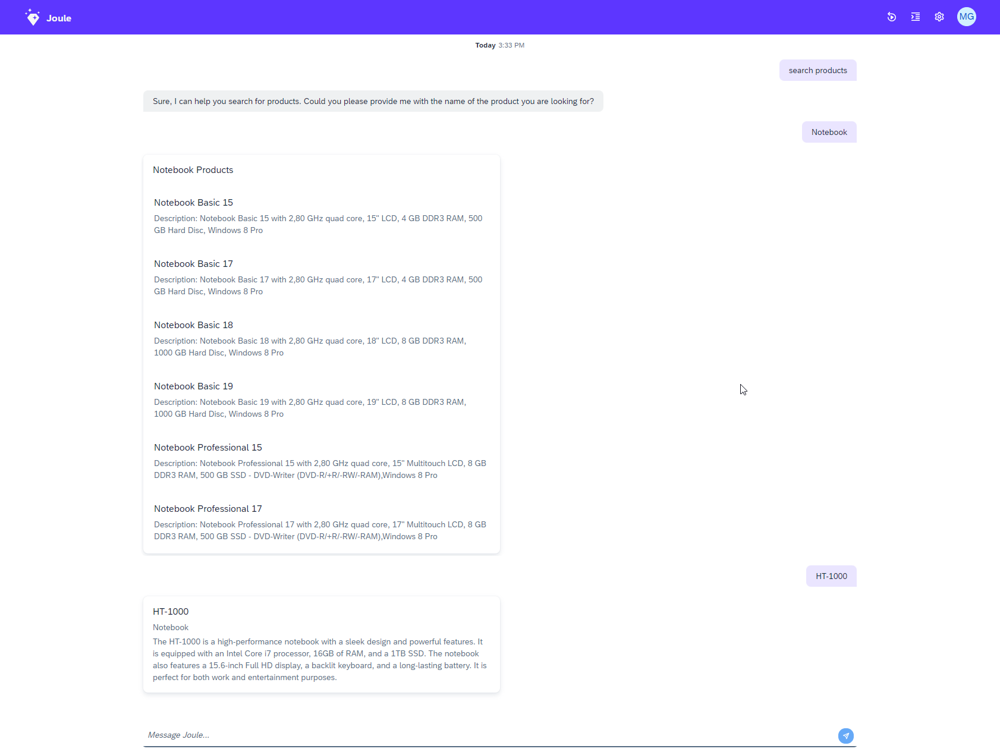

# Search Products - Step 4: Implementing the product name filter

Now we will add a filter for the product name that is sent to the OData service.

## Preview



*The project with the fetch product dialog function added*

## Steps

### capabilities/products/scenarios/fetch_product.yaml

```yaml
description: Search for products and answers detailed questions on ratings, price, technical specifications and supplier
slots:
  - name: product_name
    description: Name of the product

target:
  type: function
  name: fetch_product_info

response_context:
  - description: Product details to be displayed
    value: products
```

We now add a parameter (slots) for the product name that can be used for searching specific products.
Be sure to provide a meaningful description for the function as this parameter will be used by the dialog model to dispatch the user utterance to the right joule function.

1. Add the `product_name` slot to the `fetch_product.yaml` scenario in the `products` capability and give a meaningful description.

### capabilities/products/functions/fetch_product_info.yaml

```yaml
parameters:
  - name: product_name
    optional: true
action_groups:
  - actions:
      - type: set-variables
        variables:
          - name: odata_filters
            value: []
  - condition: product_name != null
    actions:
      - type: set-variables
        variables:
          - name: name_filter
            value:
              service-attribute: substringof(Name, '<? product_name ?>')
              filter-operator: eq
              service-value: true
          - name: odata_filters
            value: <? odata_filters.append(name_filter) ?>
  - actions:
      - type: set-variables
        scripting_type: handlebars
        variables:
          - name: filter_string
            value: "{{odataFilter odata_filters}}"
      - type: api-request
        method: GET
        system_alias: ProductService
        path: "/EPM_REF_APPS_SHOP_SRV/Products?$format=json&$top=5<? filter_string != null ? '&$filter=' + filter_string : '' ?>"
        result_variable: product_results
result:
  products: <? product_results.body.d.results ?>
```
1. Update the `fetch_product_info.yaml` function in the `products` capability with the new logic for defining the filter.
2. We add a new `parameters` section with a parameter for the product name.
3. We start by defining an empty `odata_filters` array.
4. We check if the user has provided a product name. If so, we set a search filter on the OData property 'Name'.
5. We use the handlebars helper function `odataFilter` to convert and concatenate the filters in the correct format.
6. We append the concatenated filter string in the variable `filter_string` to the OData endpoint

Let's break down the new code into more details: First, we have the new parameter which is marked as optional. The user can specify a product to filter the results set with this parameter. 
The first action simply defines an empty `odata_filters` array. As the parameter is optional, we only add the corresponding filter to the array if needed in the next block.

In the new condition below, we check if the user has provided a product name. OData services require a `$filter` argument in a specific format to be passed to its endpoint.
If you like to know more about querying and filtering OData services, please have a look at the [OData tutorial](https://www.odata.org/getting-started/basic-tutorial/#queryData).

If a `product_name` has been specified, we set a search filter on the OData property 'Name' that will be later composed to the expression `substringof('Name', '<product_name>') eq 'true'`.
The `name_filter` helper variable is used to store the filter object for this configuration.

In the next action, we use the handlebars helper function `odataFilter` to convert and concatenate the filters in the correct format. The `filter_string` variable is used to store the final filter string.
Finally, we can call the ES5 `Products` OData endpoint with the result set limited to 10 items and the filter string appended to the URL and store the result in the `product_results` variable.

The final URL will look like this:
```/EPM_REF_APPS_SHOP_SRV/Products?$format=json&$top=10&$filter=substringof('Name', 'HT-1000') eq 'true'```

To get a better idea of the API response returned by the API, the following URL can be either called via Postman or directly in the browser: https://sapes5.sapdevcenter.com/sap/opu/odata/sap/EPM_REF_APPS_SHOP_SRV/Products?$format=json&$top=10&$filter=substringof(%27Name%27,%27HT-1000%27)%20eq%20%27true%27

As the `result` for this function, we simply pass the array of products. We will implement error handling in the next step.

## Test your result

1. Run the following command in your `capabilities` folder to deploy your assistant:
```bash
joule deploy -c -n "products"
```

2. Run the following command to open the standalone web client:
```bash
joule launch "products"
```
1. A Browser will open with the joule web client. You can now test your assistant in the chat window.
2. Type `View products` to call the new capability.
3. This time, Joule will ask you to provide a name to search for
4. Enter `Notebook` to get a filtered list of notebooks
5. Enter `HT-1000` to just get the details for a specific product

* [Back to Overview](../index.md)
* [Continue with Step 5](../step5/index.md)

## Related Information 

[Dialog Functions](https://help.sap.com/docs/joule/service-guide/dialog-functions)
