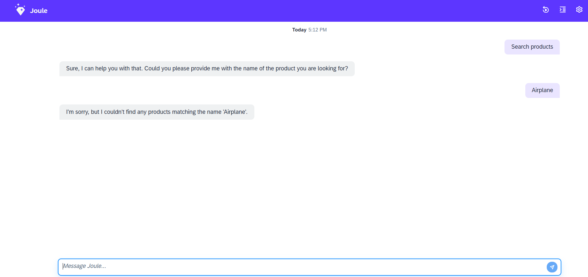

# Search Products - Step 5: Add error handling and test the final "products" capability

In this step, we will deploy the assistant test our final product search capability.

## Preview



*Our assistant can now search for and filter products from the Gateway demo service.*

## Steps

### capabilities/products/scenarios/fetch_product.yaml

```yaml
description: Search for products and answers detailed questions on ratings, price, technical specifications and supplier
slots:
  - name: product_name
    description: Name of the product

target:
  type: function
  name: fetch_product_info

response_context:
  - description: Product details to be displayed
    value: products
  - description: Error message in case the product service fails
    value: error_message
```

1. Add an `error_message` parameter to the response context to handle issues with the result set or service errors and give it a meaningful description

### capabilities/products/functions/fetch_product_info.yaml

```yaml
parameters:
  - name: product_name
    optional: true
action_groups:
  - actions:
      - type: set-variables
        variables:
          - name: odata_filters
            value: []
  - condition: product_name != null
    actions:
      - type: set-variables
        variables:
          - name: name_filter
            value:
              service-attribute: substringof(Name, '<? product_name ?>')
              filter-operator: eq
              service-value: true
          - name: odata_filters
            value: <? odata_filters.append(name_filter) ?>
  - actions:
      - type: set-variables
        scripting_type: handlebars
        variables:
          - name: filter_string
            value: "{{odataFilter odata_filters}}"
      - type: api-request
        method: GET
        system_alias: ProductService
        path: "/EPM_REF_APPS_SHOP_SRV/Products?$format=json&$top=5<? filter_string != null ? '&$filter=' + filter_string : '' ?>"
        result_variable: product_results
  - condition: product_results == null || product_results.status_code != 200
    actions:
      - type: set-variables
        variables:
          - name: error_message
            value: An error occured when fetching products
  - condition: product_results != null && product_results.body.d.results.size() == 0
    actions:
      - type: set-variables
        variables:
          - name: error_message
            value: No products found
result:
  error_message: "<? error_message ?>"
  products: <? product_results.body.d.results ?>
```

1. Copy the code of the final version of our function with error handling above.
2. We added two conditions after the service call
3. The first condition checks if the service call's status code was successful or the result is null - this corresponds to a technical error with the service.
4. The second condition checks if the result array is empty, e.g. if no products were found by the service - this is simply checking for an empty result set.
5. In both cases we set the variable `error_message` with a meaningful description of the problem.
6. Finally, we return the `error_message` in addition to the `products` array as the result of the function.

### capabilities/products/scenarios/fetch_product.yaml

```yaml
description: Search for products and answers detailed questions on ratings, price, technical specifications and supplier
slots:
  - name: product_name
    description: Name of the product

target:
  type: function
  name: fetch_product_info

response_context:
  - description: Product details to be displayed
    value: products
  - description: Error message in case the product service fails
    value: error_message
```

1. Reference the `error_message` result variable in the response context and give it a meaningful description. The LLM is now able to provide a more meaningful answer in case no data was returned from the backend.

## Test your result

1. To test the technical error, you can add a typo anywhere in the service path

2. Run the following command in your `capabilities` folder to deploy your assistant:
```bash
joule deploy -c -n "products"
```

3. Run the following command to open the standalone web client:
```bash
joule launch "products"
```
4. A Browser will open with the joule web client. You can now test your assistant in the chat window.
5. Type `Search for Notebooks` to trigger the failing API url
6. You should see a dynamic error message indicating that an error occurred during fetching
7. Revert the type and redeploy the assistant
8. Type `Show HT-9999 product` to search for a product that does not exist
9. You should see a dynamic error message indicating that no product was found

* [Back to Overview](../index.md)

## Related Information

[Test the capability](https://help.sap.com/docs/joule/service-guide/test-capability)
