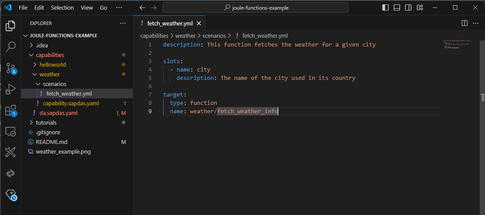

# Fetch Weather - Step 2: Create the weather capability and scenario

In this step, we will add the new weather capability to our assistant.

*Please note that the Joule IDE Extension does not support the latest schema and Joule functions yet. 
For the moment, we will manually create the needed assets and update the tutorial later on when this functionality is available.*  

## Preview



*The project with the second capability and scenario added*

## Steps

### capabilities/da.sapdas.yaml


```yaml
schema_version: 1.0.0
name: joule_assistant
capabilities:
  - type: local
    folder: ./helloworld
  - type: local
    folder: ./weather

```

1. After `helloworld`, add a new capability of type `local` and set the folder to `./weather`

### capabilities/weather/capability.sapdas.yaml (NEW)

```yaml
schema_version: 3.6.0

metadata:
  namespace: com.sap.das.demo
  name: weather_example_capability
  version: 1.0.0
  display_name: "Weather Capability"
  description: Collects weather information for a given location.

system_aliases:
  WeatherService:
    destination: WEATHER
```

We add a new weather capability to our assistant by specifying the display name and the description:

1. Create a new subfolder in your `capabilites` folder and name it `weather`.
2. Add a new file `capability.sapdas.yaml` in the newly created folder
3. Define the basic parameters for this capability as shown above
4. In the `system_aliases` we reference the newly created BTP destination with the alias `WeatherService`.

### capabilities/weather/scenarios/fetch_weather.yaml (NEW)

```yaml
description: This function fetches the weather for a given city

slots:
  - name: city
    description: The name of the city used in its country

target:
  type: function
  name: fetch_weather_info
```
Next, we define the scenario for the capability. It contains the parameters (slots) and the joule function to call.
Be sure to provide a meaningful description for the function as this parameter will be used by the dialog model to find the function.

1. Create a new folder in your `weather` folder and name it `scenarios`.
2. Create a new file `fetch_weather.yaml` in the newly created folder
3. Define a slot `city` that can be filled with a city name for the weather request
4. Define the target joule function `fetch_weather_info` that will be called when the scenario is triggered

Note that we do not have to define dialogs and intent structures anymore with the new Joule architecture.
The description of the scenario and the slots is sufficient to trigger the function implicitely.

## Summary

We have added a second assistant to our project. It won't run yet since the actual function is still missing.
This will be covered in Step 3. The overall project structure should look like this:

```
└── capabilities/ // assistant root
    ├── helloworld... 
    └── weather/ // weather capability
        ├── scenarios/ // root for scenarios
            └── fetch_weather.yaml // weather scenario
        └── capability.sapdas.yaml // capability definition
    └── da.sapdas.yaml  // assistant definition combining capabilities
```

* [Back to Overview](../index.md)
* [Continue with Step 3](../step3/index.md)

## Related Information 

[Build a capability](https://help.sap.com/docs/joule/service-guide/build-capability)
