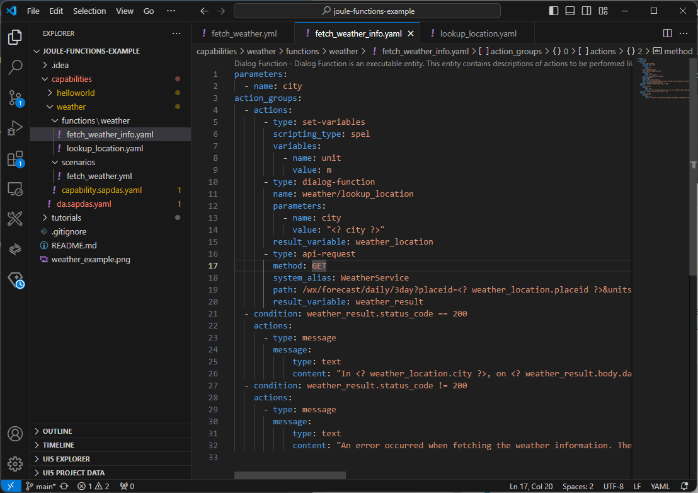

# Fetch Weather - Step 3: Create the weather API function call

Now, it is time to see how Joule makes API requests fetch the weather information from the external weather API.

## Preview



*The project with the weather and location lookup function added*

## Steps

We will now create `fetch_weather_info` and `lookup_location` functions within the `functions` folder.

### capabilities/weather/functions/lookup_location.yaml (NEW)

```yaml
parameters:
  - name: city
action_groups:
  - actions:
      - type: api-request
        method: GET
        system_alias: WeatherService
        path: "/location/search?query=<? city ?>&language=en-US&format=json"
        result_variable: lookup_result
      - type: set-variables
        scripting_type: handlebars
        variables:
         - name: postalCode
           value: "{{first lookup_result.body.location.postalCode}}"
result:
  success: <? lookup_result.status_code == 200 ?>
  city: <? lookup_result.body.location.address[0] ?>
  placeid: <? lookup_result.body.location.placeId[0] ?>
  postalCode: <? postalCode ?>
```
1. Create a folder `functions` in the `weather` capability.
2. Create a file `lookup_location.yaml` in the `functions` folder of the `weather` capability.
3. Copy the code above into the file and see the explanation for the helper function below. 

The `lookup_location` dialog helper function will be used to look up the city entered by the user to a `placeid`, which is required for querying the weather information. A `city` parameter is required for this dialog function. In the actions of the dialog function, the GET call to the following endpoint should be performed by using the `WeatherService` system alias:

```/location/search?query=<? city ?>&language=en-US&format=json```

To get a better idea of the API response returned by the API, the following URL can be either called via Postman or directly in the browser: https://api.weather.com/v3/location/search?query=Walldorf&language=en-US&format=json&apiKey=c322ef22435d40bfa2ef22435df0bfbe

Following fields should be returned in the result of the dialog function (using some SpEL expressions):
- success: boolean to indicate if the lookup was successful
- city: full city details of the city that was found
- placeid: ID required for the weather API representing the city
- postalCode: the postal code of the retrieved city

The postal code is extracted with a handlebars expression from the lookup result. As it is a nested JSON object, only the first element of the array is written to variable `postalCode`.

### capabilities/weather/functions/fetch_weather_info.yaml (NEW)

```yaml
parameters:
  - name: city
action_groups:
  - actions:
      - type: set-variables
        scripting_type: spel
        variables:
          - name: unit
            value: m
      - type: dialog-function
        name: lookup_location
        parameters:
          - name: city
            value: "<? city ?>"
        result_variable: weather_location
      - type: api-request
        method: GET
        system_alias: WeatherService
        path: /wx/forecast/daily/3day?placeid=<? weather_location.placeid ?>&units=<? unit ?>&language=en-US&format=json
        result_variable: weather_result
  - condition: weather_result.status_code == 200
    actions:
      - type: message
        message:
          type: text
          content: "In <? weather_location.city ?>, on <? weather_result.body.dayOfWeek[0] ?> temperature will be between <? weather_result.body.calendarDayTemperatureMin[0] ?> °C and <? weather_result.body.calendarDayTemperatureMax[0] ?> °C. Details: <? weather_result.body.narrative[0] ?>"
  - condition: weather_result.status_code != 200
    actions:
      - type: message
        message:
          type: text
          content: "An error occurred when fetching the weather information. The result was: <? weather_result ?>"
```

1. Create a file `fetch_weather_info.yaml` in the `functions` folder of the `weather` capability.
2. Copy the code above into the new file and analyze the configuration of the service call.

The `fetch_weather_info` dialog function will fetch the weather information for a given city and returns a message with the details to the user. 

It requires a mandatory `city` parameter and executes the following actions:
- setting the units to metric
- a dialog function action to call the previously defined `lookup_location` dialog function
- the actual API call to the weather API (again using the `WeatherService` system alias)

  ```/wx/forecast/daily/3day?placeid=<? weather_location.placeid ?>&units=<? unit ?>&language=en-US&format=json```

To get a better idea of the API response returned by the API, the following URL can be either called via Postman or directly in the browser: https://api.weather.com/v3/wx/forecast/daily/3day?placeid=b1acb26e1ddc17dd5ba19c9ef4ec23a6b6ccb3a8c4e67477e6ef984c8bd8dd04&units=m&language=en-US&format=json&apiKey=c322ef22435d40bfa2ef22435df0bfbe

As results of the dialog function the following fields should be returned:
- success: boolean to indicate if the lookup was successful
- minTemp / maxTemp: minimum and maximum temperature in celcius degrees for today
- dayOfWeek: weekday of today
- narrative: description of today's weather

In case the API returns an HTTP status code of `200 - Success`, we compose a message with the weather information for the provided location.
In case of an error, we return a message with the error details. 


## Summary

We have now added the dialog functions to the external API to our project and are ready to test it.
This will be covered in Step 4. The overall project structure should look like this:

```
└── capabilities/ // assistant root
    ├── helloworld... 
    └── weather/ // weather capability
        ├── functions/ // root for functions
            ├── fetch_weather_info.yaml // weather function
            └── lookup_location.yaml // location lookup helper function 
        ├── scenarios/ // root for scenarios
            └── fetch_weather.yaml // weather scenario
        └── capability.sapdas.yaml // capability definition
    └── da.sapdas.yaml  // assistant definition combining capabilities
```

* [Back to Overview](../index.md)
* [Continue with Step 4](../step4/index.md)

## Related Information 

[Dialog Functions](https://help.sap.com/docs/joule/service-guide/dialog-functions)
