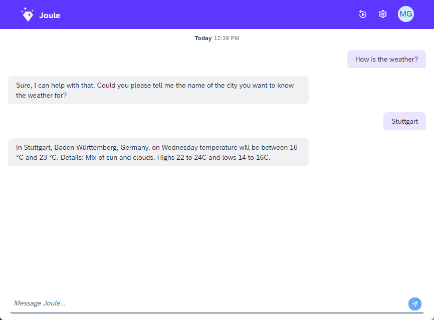

# Fetch Weather - Step 4: Deploy the assistant and test the "weather" capability

In this step, we will deploy the assistant test our new weather capability.

## Preview



*Our assistant is now capable of fetching the weather for a given location.*

## Steps

A more detailed description of the login and deployment with the joule CLI can be found in the [Hello World - Step 3](../../helloworld/step3/index.md) tutorial.

### Deploy your assistant

1. Run the following command in your `capabilities` folder to deploy your assistant:
```bash
joule deploy -c -n "weather"
```

By specifying the `-c` option, you will implicitly compile the assistant before deploying it.

Specify a name parameter with the `-n` option to give your assistant a name. This name will be used to identify your assistant in the Joule server and help to avoid conflicts with other assistants running on the same account.

### Test your assistant in the standalone web client:

1. Run the following command to open the standalone web client:
```bash
joule launch weather
```
2. A Browser will open with the joule web client. You can now test your assistant in the chat window.
3. Type "How is the weather" to test if the new capability can be called.
4. Note that Joule asks you to provide a city even though we haven't defined this behavior. It is done implicitly because the city slot of the scenario is not filled.
5. Enter a city and Joule will call the dialog function that returns the weather information for the given location.
6. Alternatively, you can try other queries like "What is the weather in \<city>\ like" or "How is the weather in \<city>\ to get a direct response

* [Back to Overview](../index.md)
* [Continue with Step 5](../step5/index.md)

## Related Information 

[Test the capability](https://help.sap.com/docs/joule/service-guide/test-capability)
